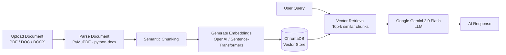
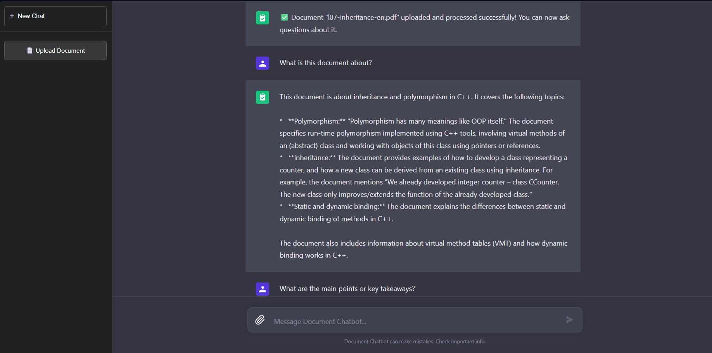
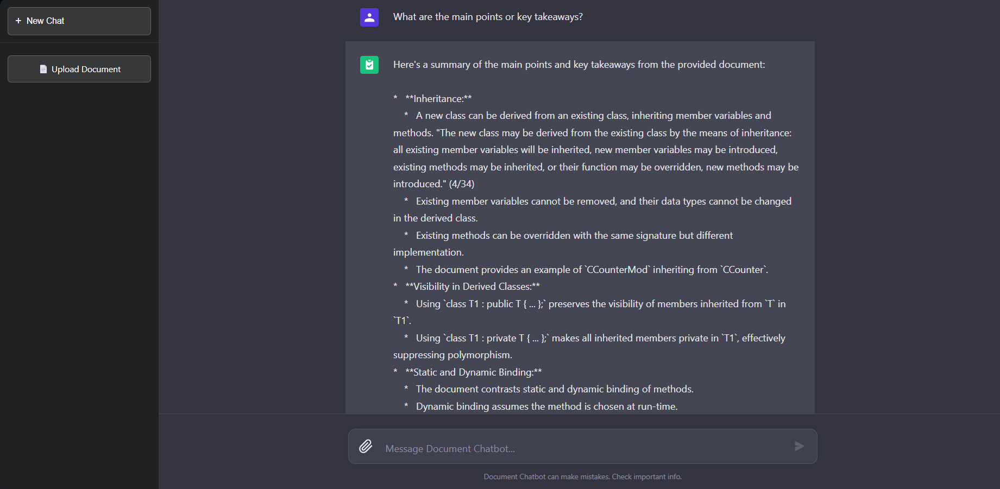
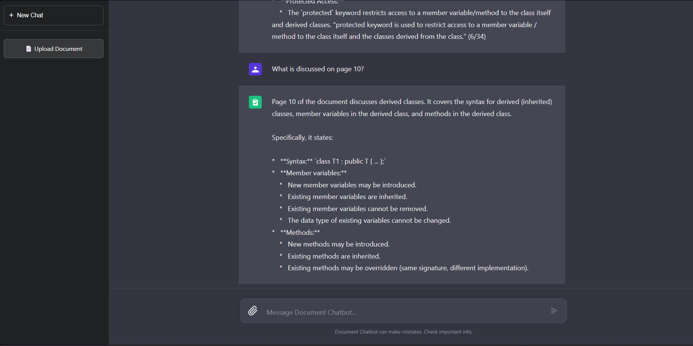
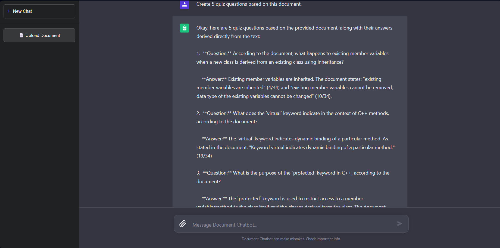

# Document Chatbot

[](https://www.python.org/)
[](https://fastapi.tiangolo.com/)
[](https://react.dev/)
[](https://www.trychroma.com/)
[](https://ai.google.dev/)
[](https://www.docker.com/)
[](LICENSE)

> Full-stack **RAG (Retrieval-Augmented Generation)** chatbot — upload PDF/DOCX documents and chat with their contents.

---

## 📖 About

Document Chatbot is a full-stack **RAG (Retrieval-Augmented Generation)** application that allows users to upload PDF/DOC/DOCX files and ask context-aware questions about their content.

The project combines **FastAPI**, **ChromaDB**, and **Google Gemini 2.0 Flash** for semantic retrieval and AI-powered responses, with a **React** frontend for real-time document conversations.

## 🏗️ How It Works



1. **Document Ingestion** — User uploads a file via the React UI.
2. **Parsing & Chunking** — FastAPI parses the document and splits it into semantic chunks.
3. **Embedding** — Each chunk is embedded (OpenAI API with sentence-transformers fallback) and stored in ChromaDB.
4. **Retrieval** — On each user query, the top-k most relevant chunks are retrieved by vector similarity.
5. **Generation** — Retrieved chunks + user query are sent to Gemini 2.0 Flash to generate the final, grounded answer.

## 🖼️ Screenshots

| Document Upload & First Query | Detailed RAG Response with Citations |
|:---:|:---:|
|  |  |
| **Page-Specific Query** | **AI-Generated Quiz from Document** |
|  |  |

> Answers include source citations (e.g. `(4/34)`, `(31/34)`) that reference the exact page in the uploaded document — making every response verifiable.

## ✨ Features

### 📄 Document Processing
- PDF, DOC, and DOCX upload
- Semantic chunking
- Multi-document indexing
- Page-specific querying (_"what is on page 5?"_)

### 🤖 AI & Retrieval
- ChromaDB vector search
- Context-aware, grounded responses
- Google Gemini 2.0 Flash integration
- Smart query preprocessing
- Hybrid embedding pipeline (OpenAI → Sentence-Transformers fallback)

### ⚛️ Frontend & UX
- ChatGPT-style chat interface
- Conversation history
- Per-document conversation isolation
- Responsive React UI

### 🐳 DevOps
- Dockerized deployment (Docker · docker-compose)
- Nginx reverse proxy configuration
- CI/CD pipeline preparation

## 🛠️ Tech Stack

| Layer | Technology |
|-------|-----------|
| **Backend** | FastAPI · Uvicorn · Python 3.10+ |
| **Frontend** | React 18 · Axios · CSS3 |
| **Vector DB** | ChromaDB |
| **LLM** | Google Gemini 2.0 Flash |
| **Embeddings** | OpenAI API (primary) · sentence-transformers (fallback) |
| **Document Parsing** | PyMuPDF (fitz) · python-docx |
| **Deployment** | Docker · docker-compose · Nginx |
| **CI/CD** | Automated build / test / deploy workflow |

## 🚀 Quick Start

**Windows (easiest):** Double-click `START_PROJECT.bat` — both backend and frontend will start in separate windows.

**Manual:**

```bash
# Backend
cd backend
pip install -r requirements.txt
# Create .env with GOOGLE_API_KEY (see .env.example)
python -m uvicorn app.main:app --host 127.0.0.1 --port 8000

# Frontend (in a new terminal)
cd frontend
npm install
npm start
```

Access the app at **http://localhost:3000** (frontend) and **http://127.0.0.1:8000** (API).

## ⚙️ Detailed Setup

### Prerequisites
- Python 3.10+
- Node.js 16+ and npm
- Google AI Studio API key ([get one here](https://makersuite.google.com/app/apikey))
- (Optional) OpenAI API key for better embeddings

### Backend

```bash
cd backend
python -m venv venv

# Activate venv
venv\Scripts\activate          # Windows
source venv/bin/activate       # macOS/Linux

pip install -r requirements.txt
```

Create a `.env` file in the `backend/` directory:

```env
GOOGLE_API_KEY=your-google-api-key-here
OPENAI_API_KEY=your-openai-api-key-here   # optional
```

Run the server:

```bash
python -m uvicorn app.main:app --host 127.0.0.1 --port 8000
```

### Frontend

```bash
cd frontend
npm install
npm start
```

### Docker

```bash
docker-compose up --build
```

Includes Dockerized deployment setup, Nginx reverse proxy configuration, and CI/CD workflow preparation.

## 💡 Usage Examples

After uploading a document, try queries like:

- _"What is this document about?"_
- _"Summarize the main points."_
- _"What is on page 5?"_
- _"Create 10 quiz questions about this document."_
- _"What are the key takeaways from chapter 2?"_

## 📡 API Endpoints

| Method | Endpoint | Description |
|--------|----------|-------------|
| `POST` | `/api/documents/upload` | Upload and process a document |
| `GET`  | `/api/documents/list` | List processed documents |
| `POST` | `/api/chat/` | Send a chat message |
| `GET`  | `/api/chat/conversation/{id}` | Get conversation history |
| `GET`  | `/api/health` | Health check |

Interactive API docs available at **http://127.0.0.1:8000/docs** (Swagger UI).

## 📝 Notes & Current Limitations

- Documents are processed and stored in a local ChromaDB instance (`backend/chroma_db/`)
- **Conversations are stored in memory** — not persisted across server restarts
- Uploaded files are stored in `backend/uploads/`
- Each conversation is tied to a specific document for accurate, grounded answers
- First run may take longer as embedding models are downloaded

## 🐛 Troubleshooting

<details>
<summary><b>Backend issues</b></summary>

- Ensure all Python dependencies are installed (`pip install -r requirements.txt`)
- Check that port 8000 is not in use
- Verify `backend/.env` exists with a valid `GOOGLE_API_KEY`
</details>

<details>
<summary><b>Frontend issues</b></summary>

- Ensure Node.js 16+ and npm are installed
- Try clearing npm cache: `npm cache clean --force`
- Check that port 3000 is not in use
</details>

<details>
<summary><b>Embedding / chat issues</b></summary>

- If OpenAI API is not available, sentence-transformers will be used automatically
- First run may take longer as embedding models are downloaded
- Make sure the Gemini API key is valid and active
</details>

## 🚧 Future Improvements

- Persistent conversation storage (PostgreSQL / Redis)
- User authentication & multi-user support
- Streaming AI responses (Server-Sent Events)
- Hybrid search (BM25 + vector search)
- Document summarization workflows
- Kubernetes deployment manifests
- End-to-end test coverage

## 👤 Author

**Aylin Kars**
Czech Technical University in Prague — FIT
🔗 [GitHub](https://github.com/karsayli)

## 📄 License

This project is licensed under the **MIT License** — see the [LICENSE](LICENSE) file for details.
